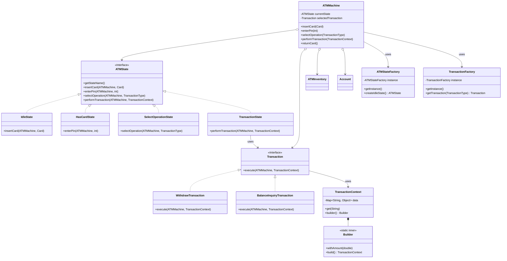

# Advanced ATM System Architecture

## Overview

This project is an advanced, object-oriented simulation of an Automated Teller Machine (ATM) built in Java. It serves as a powerful example of applying core software design patterns to create a system that is robust, scalable, and easy to maintain.

The architecture is meticulously crafted around a suite of design patterns working in harmony: the **State**, **Command**, **Builder**, and **Factory** patterns. This results in a clean, decoupled system that adheres to SOLID principles.

### Key Features

* **State-Driven Workflow:** Securely manages user sessions from card insertion to completion.
* **Extensible Transaction System:** Easily add new transaction types (e.g., Transfer, Deposit) without modifying core code.
* **Fluent and Flexible API:** Cleanly construct transaction data using a Builder pattern.
* **Safe Cash Dispensing:** Utilizes a "plan-then-commit" strategy to ensure inventory is only updated on successful transactions.
* **SOLID Principles:** Heavily emphasizes the Single Responsibility and Open/Closed principles.

-----

## Architectural Design

The system's architecture is designed to be highly modular and decoupled. Each component has a single, well-defined responsibility.

### Component Overview

```
ATMMachine (The Core Orchestrator)
 │
 ├── state package (Manages the "what can be done now?")
 │   └── ATMState (Interface for Idle, HasCard, SelectOperation, etc.)
 │
 ├── transaction package (Manages the "what to do?")
 │   ├── Transaction (Interface for Withdraw, BalanceInquiry, etc.)
 │   └── TransactionContext (Data carrier for transactions, built by a Builder)
 │
 ├── model package (Simple data objects like Account, Card, Enums)
 │
 └── ATMInventory (Manages cash supply)
```

### Design Principles & Choices 🧠

* **State Pattern:** The ATM's entire workflow is managed by state objects (`IdleState`, `HasCardState`, etc.). The `ATMMachine` delegates all actions to its current state.

    * **Why?** This eliminates massive `if/else` or `switch` statements in the main class. The logic for what can happen in a given state is encapsulated within that state's class, making the system easy to understand and modify.

* **Command Pattern:** Each transaction (`WithdrawTransaction`, `BalanceInquiryTransaction`) is an encapsulated "command" object.

    * **Why?** This decouples the `ATMMachine` from the specific logic of any transaction. To add a new feature like "Pay Bill," you simply create a new `PayBillTransaction` class. The core ATM logic **does not change**. This is a perfect example of the **Open/Closed Principle**.

* **Builder Pattern:** The `TransactionContext` object, which carries data for transactions, is constructed using a fluent Builder.

    * **Why?** It solves the problem of creating an object with multiple, potentially optional, parameters. The chainable `builder().withAmount(...).build()` syntax is highly readable and prevents constructor hell.

* **Factory Pattern:** `ATMStateFactory` and `TransactionFactory` are used to create state and transaction objects.

    * **Why?** This decouples the `ATMMachine` from knowing how to create specific concrete objects. It centralizes object creation, making it easier to manage and modify. Both are implemented as thread-safe Singletons as there's no need for more than one instance.

-----

## Class & Package Descriptions

### `atm` Package

* **`ATMMachine`**: The central context class. It holds the current state, manages session data (like `currentCard`), and orchestrates the overall flow but **delegates all logic** to its state and transaction objects. It is the brain of the operation, but it doesn't do the thinking itself.
* **`ATMInventory`**: Manages the cash available in the ATM. Its key feature is the `createDispensePlan` method, which safely calculates if a withdrawal is possible *before* debiting the inventory.

### `state` Package

* **`ATMState` (Interface)**: Defines the contract for all states with `default` methods for all user actions. This ensures that states only need to implement the actions relevant to them.
* **`IdleState`, `HasCardState`, `SelectOperationState`, `TransactionState`**: Concrete implementations that define the specific behavior and transitions for each step of the user's interaction with the ATM.

### `transaction` Package

* **`Transaction` (Interface)**: The "Command" interface. It defines a single `execute` method, ensuring all transaction objects are interchangeable.
* **`WithdrawTransaction`, `BalanceInquiryTransaction`**: Concrete commands that contain the specific business logic for performing their respective tasks.
* **`TransactionContext`**: A flexible data object created by a **nested Builder**. It carries the necessary parameters (e.g., amount) to a `Transaction`, allowing the `execute` method signature to remain stable and clean.
* **`TransactionFactory`**: A Singleton factory that provides the correct `Transaction` object based on user selection, hiding the creation logic.

### `model` Package

* Contains Plain Old Java Objects (POJOs) like `Account` and `Card`, as well as enums (`CashType`, `TransactionType`). These classes purely hold data and have no business logic.

-----

## UML Class Diagram

This diagram illustrates the relationships between the key components in the final, refactored design.

